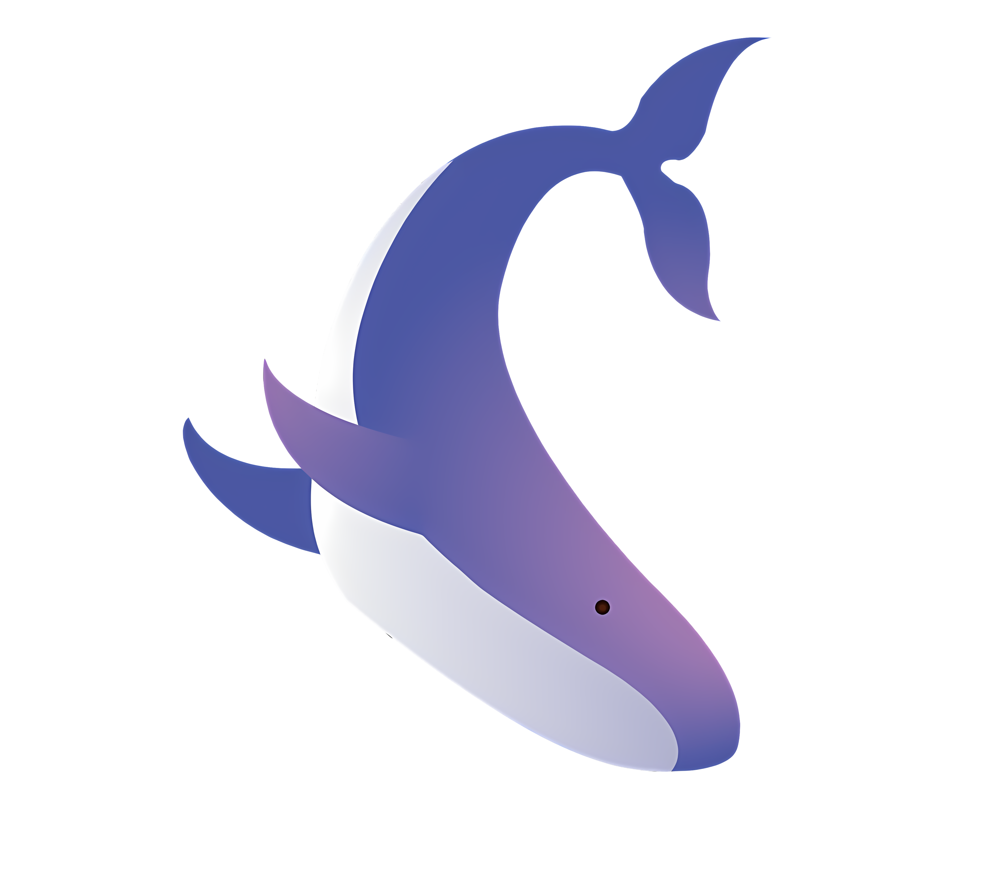

<div align="center">
  
  <h1>🐋 MyLife</h1>
  <p><strong>Catat dan kelola hidupmu dengan lebih baik.</strong></p>

  <p>
    <a href="#features"></a>
    <a href="#tech-stack"></a>
    <a href="#license"></a>
  </p>
</div>

---

## ✨ About

**MyLife** is a modern, all-in-one personal life tracker built with a sleek glassmorphism UI. Track your finances, study sessions, notes, quotes, and more — all in one beautiful dashboard.

---

## 🚀 Features

| Feature | Description |
|---------|-------------|
| 📊 **Dashboard** | Overview of all your life metrics at a glance |
| 💰 **Finance Tracker** | Track income & expenses with visual charts |
| ⏱️ **Study Timer** | Pomodoro-style timer for focused study sessions |
| 📝 **Private Notes** | PIN-protected personal notes |
| 💬 **Quotes** | Save and manage your favorite quotes |
| 🎮 **Character** | Gamified self-improvement tracking |
| 📅 **360 Days** | Year-long goal & habit tracker |
| 🤖 **Sherly AI** | Built-in AI assistant powered by Gemini |

---

## 🛠️ Tech Stack

<div align="center">

| Technology | Purpose |
|:---:|:---:|
|  | Frontend Framework |
|  | Type Safety |
|  | Auth & Database |
|  | Build Tool |
|  | Styling |
|  | Animations |

</div>

---

## 📦 Getting Started

### Prerequisites

- **Node.js** v18+
- **Firebase Project** with Authentication & Firestore enabled

### Installation

```bash
# Clone the repository
git clone https://github.com/zero0-sys/mylife.git
cd mylife

# Install dependencies
npm install

# Set up environment variables
cp .env.example .env
# Fill in your Firebase config values in .env

# Start development server
npm run dev
```

### Environment Variables

```env
VITE_FIREBASE_API_KEY=your_api_key
VITE_FIREBASE_AUTH_DOMAIN=your_project.firebaseapp.com
VITE_FIREBASE_PROJECT_ID=your_project_id
VITE_FIREBASE_STORAGE_BUCKET=your_project.appspot.com
VITE_FIREBASE_MESSAGING_SENDER_ID=your_sender_id
VITE_FIREBASE_APP_ID=your_app_id
VITE_FIREBASE_FIRESTORE_DATABASE_ID=(default)
```

---

## 🖼️ Preview

<div align="center">
  <p><em>Glassmorphism UI with dark theme — elegant and modern.</em></p>
</div>

---

## 📄 License

This project is licensed under the **MIT License** — see the [LICENSE](LICENSE) file for details.

---

<div align="center">
  
  <p>Made with ❤️ by <strong><a href="https://github.com/zero0-sys">zero0-sys</a></strong></p>
</div>
